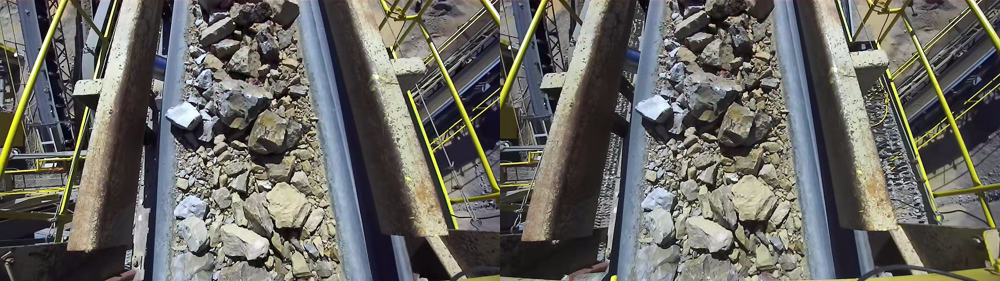

# Strayos computer vision code challenge

## 1. Task
Measurement of conveyor belt moving speed is helpful to understand and track the rock movements. The goal for this task is to dynamically measure the actual moving speed of the conveyor belt.

## 2. Data
The data is an SVO recording recorded via ZED stereo camera, located under data folder [belt_sample](data/belt_sample.svo). To open this file, you'll need to install the [ZED SDK](https://www.stereolabs.com/developers/release/). You can use ZED_Explorer included in the SDK to view the data. It records a moving belt with rocks at 2x720p 60FPS.
  

## 3. Requirements
[main.py](main.py) provides a sample code to show basic usage of the ZED SDK to get needed data, you should use the RGB image along with the depth data to solve the problem. You can expand it or implement your own code to solve the task. You can use Python or C++ to solve the task. Check [ZED SDK API documentation](https://www.stereolabs.com/docs/api/) for more details.

The belt speed is expected to have no acceleration, but it could be on and off. So you implementation needs to be able to handle the case when the belt is not moving and report 0m/s. As a hint, the belt moving speed in the sample is around 1.5m/s. Fluctuation of the speed is expected, but they could also be noise, we want to see how you handle the noise. Log the speed for each frame to a file. 

Besides the speed measurement, the execution speed is also important. Try to make your code as efficient as possible. You don't need to implement the fastest way, but you can add comments to explain ways that you can improve the speed further. 

The ROI of the belt and the direction will be the same for the same camera installation, but they could be different for different camera installations. It's a plus if you code can handle different ROI and direction automatically.

The code should be self-explanatory and easy to understand. You can add comments to explain your code if needed. The key is not only to solve the task, but also to show your coding skills and understanding of the problem.

## 4. Submission
You can submit your code via a zip file or a link to a git repository. Please include a README file to explain how to run your code and any other information you want to share. Send your submission to ravi@strayos.com. 

## 5. Other
The ZED SDK depends on an nvidia GPU. If you don't have one, you can still use opencv `VideoCapture` to read the SVO file. However, you won't be able to get the depth data to obtain final belt speed. Implement the part you can do and explain how you would implement the rest with depth data available, at least you should report some speed value in pixel unit.
