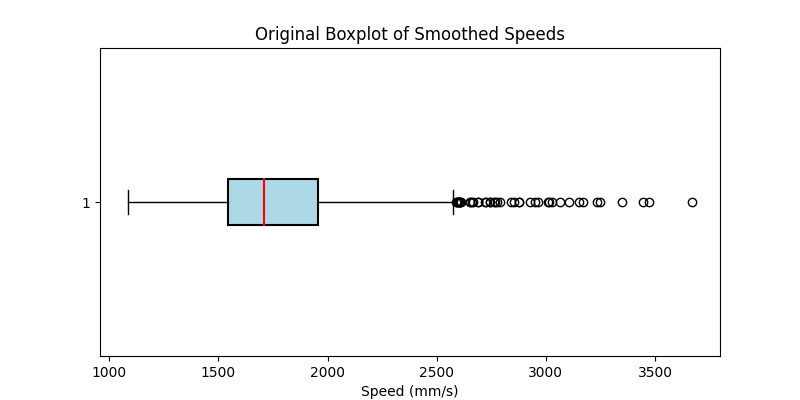
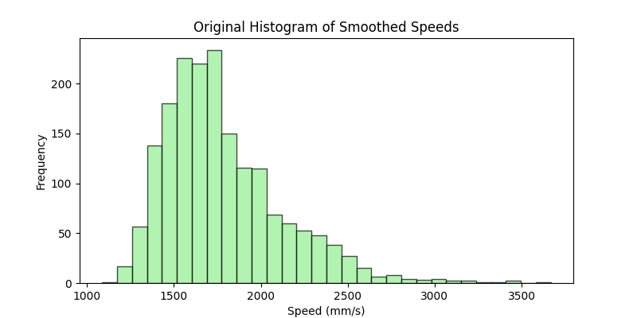

# Strayos computer vision code challenge

## 1. Task
Measurement of conveyor belt moving speed is helpful to understand and track the rock movements. The goal for this task is to dynamically measure the actual moving speed of the conveyor belt.

## 2. Data
The data is an SVO recording recorded via ZED stereo camera, located under data folder [belt_sample](data/belt_sample.svo). To open this file, you'll need to install the [ZED SDK](https://www.stereolabs.com/developers/release/). You can use ZED_Explorer included in the SDK to view the data. It records a moving belt with rocks at 2x720p 60FPS.
  


## 3. Approach
### 3.1 Input Data:
The input is a 60 FPS stereo video (SVO format) recorded using a ZED camera. Only the left camera view is processed.

### 3.2 Pre-processing:
The left camera view is extracted and polygon masking is applied to isolate the conveyor belt, reducing noise. The masked region is converted to grayscale for efficient feature detection.

### 3.3 Feature Detection and Matching:
Keypoints are detected using the SIFT algorithm, and high-confidence matches are filtered using FLANN with Lowe’s ratio test.

### 3.4 Direction Detection:
The direction of the rock movement is determined using the depth and feature flow patterns.

### 3.5 Speed Calculation:
Real-world displacement is calculated by mapping image coordinates to real-world measurements using camera calibration parameters. Speed is estimated by combining displacement and frame rate.

### 3.6 Noise Mitigation:
A Kalman Filter smoothens the speed readings by reducing noise and improving accuracy through predictive adjustments.

For more details about the approach, please refer to the [report.pdf](./report.pdf)  file available in this repository.

## 4. Installation and Usage
1. Install the [ZED SDK API](https://www.stereolabs.com/docs/installation/windows)
2. Clone the repository:
```
git clone https://github.com/VinatG/belt-speed-measurement.git
```
3. Change the directory
```
cd belt-speed-measurement
```
4. Install the required packages
```
pip install -r requirements.txt
```
5. Run the script
```
python main.py
```
6. Visualize the log files
```
python analyze_log_file.py
```

## 5. Results and Discussion

### Statistical Analysis Results
The following key statistics were derived from the processed speed data of the conveyor belt:

- **Mean**: 1778.99 mm/s  
- **Median**: 1708.75 mm/s  
- **Standard Deviation**: 340.15 mm/s  
- **1st Quartile (25%)**: 1542.68 mm/s  
- **3rd Quartile (75%)**: 1957.31 mm/s  
- **Interquartile Range (IQR)**: 414.63 mm/s  
- **Minimum**: 1086.30 mm/s  
- **Maximum**: 3668.78 mm/s  
- **Count**: 1798 entries  

---

### Visualizations

#### Boxplot


The boxplot illustrates the spread of the conveyor belt speeds, highlighting the interquartile range (IQR) and median speed. Notably, several outliers are observed beyond the upper whisker limit, which indicates occasional deviations or anomalies in the conveyor belt's operation.

#### Histogram


The histogram shows a unimodal distribution of speeds, with the majority of speeds concentrated between **1800 mm/s** and **2000 mm/s**, and a gradual tapering off for higher speeds. The slight positive skew reflects occasional instances of higher speeds, aligning with the outliers seen in the boxplot.

---

### Discussion 
   Outliers in the data, as seen in the boxplot and histogram, suggest irregularities that could arise from sudden accelerations, faulty readings, or sensor noise. These outliers can distort statistical summaries, such as the mean, and may not accurately represent the system's typical behavior. Skewness in the histogram indicates the need for robust noise-mitigation techniques.
<br />
<br />
**Outlier Mitigation Strategies**:  
   - **RANSAC (Random Sample Consensus)**:  
     RANSAC can be employed to identify and exclude outliers in feature matching or speed computation. By iteratively fitting a model to random subsets of data, RANSAC robustly estimates the core behavior while rejecting extreme deviations.

   - **IQR Method**:  
     Use the interquartile range to filter out speeds that fall below **Q1 - 1.5 × IQR** or above **Q3 + 1.5 × IQR**. 

   - **Dynamic Thresholding**:  
     Adaptive thresholds based on recent trends in the data could help detect and address sudden, unexpected spikes in speed.

By addressing outliers effectively, the system can achieve greater accuracy and reliability, ensuring smoother conveyor belt operations and more dependable speed measurements.

